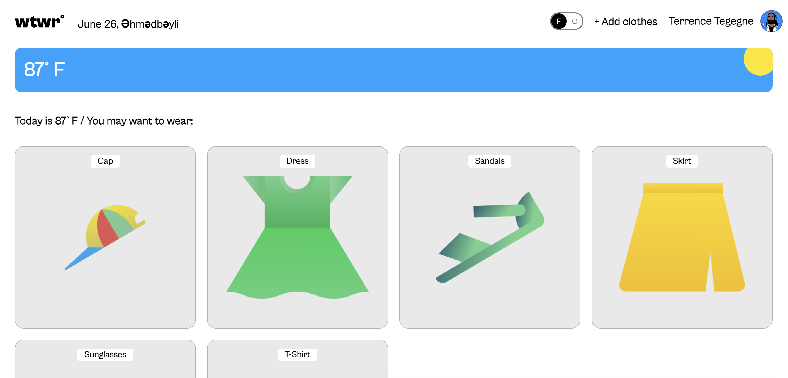
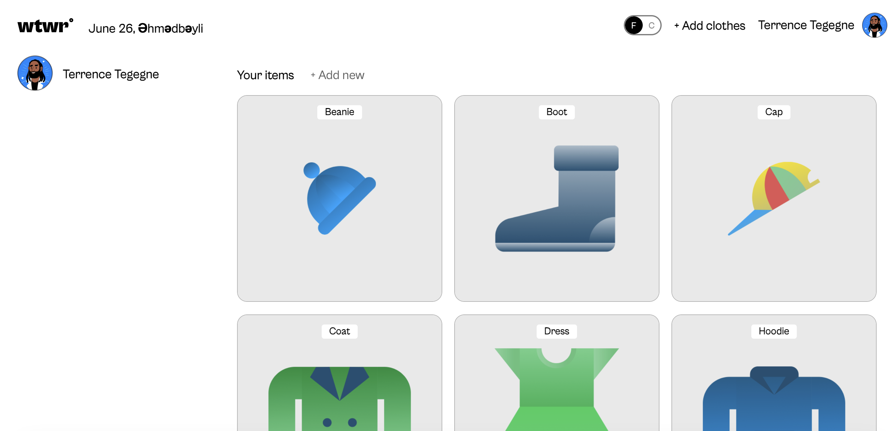
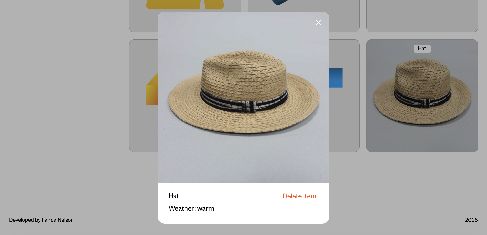
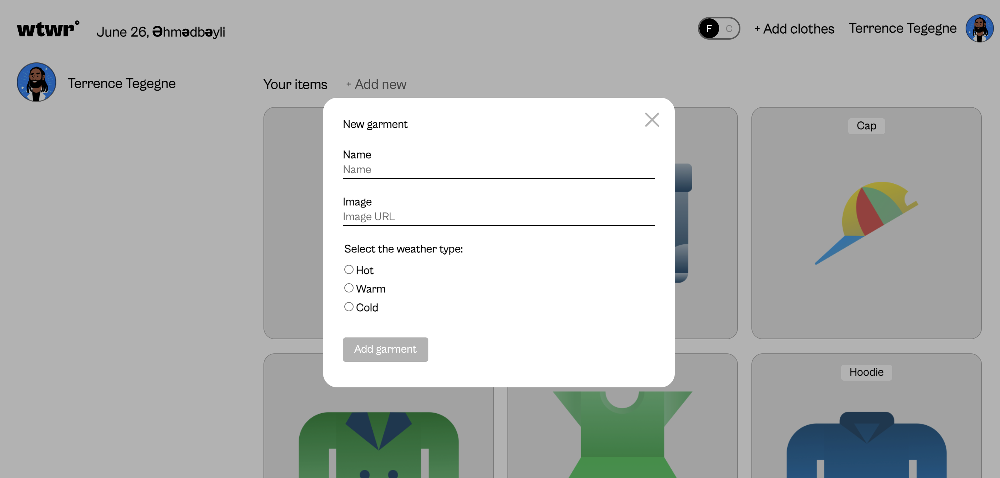
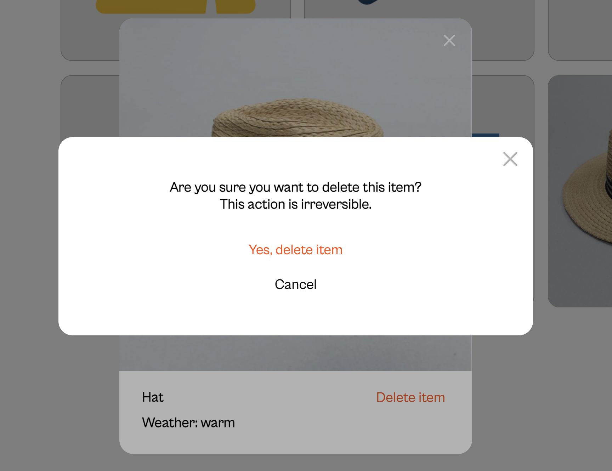

# 🌤️ WeatherApp

WeatherApp is a responsive web application that provides real-time weather information based on the user's current location or a searched city. It's built using modern JavaScript and React.

## 🚀 Features

- 📍 Get current weather based on your location
- 🔎 Search weather by city name
- 🌡️ Displays temperature, weather conditions, and more
- 📱 Responsive design for mobile and desktop
- 🎨 Clean and user-friendly UI

## 🛠️ Technologies Used

- React
- JavaScript (ES6+)
- HTML5 & CSS3
- Weather API (e.g., OpenWeatherMap)
- Git & GitHub
- Vite or Webpack (for development)

This template provides a minimal setup to get React working in Vite with HMR and some ESLint rules.

Currently, two official plugins are available:

- [@vitejs/plugin-react](https://github.com/vitejs/vite-plugin-react/blob/main/packages/plugin-react/README.md) uses [Babel](https://babeljs.io/) for Fast Refresh
- [@vitejs/plugin-react-swc](https://github.com/vitejs/vite-plugin-react-swc) uses [SWC](https://swc.rs/) for Fast Refresh

## 🛆 Installation

1. Clone the repository:

```bash
git clone https://github.com/your-username/weather-app.git
```

2. Navigate to the project folder:

```bash
cd weather-app
```

3. Install dependencies:

```bash
npm install
```

4. Run the app locally:

```bash
npm run dev
```

## 🔧 Configuration

To use a weather API, you'll need an API key. Create a `.env` file in the root directory:

```env
VITE_WEATHER_API_KEY=your_api_key_here
```

## 🖼️ Screenshots

### Homepage



### Profile Page



### Item Card Modal



### Add New Item Modal



### Delete Card Confirmation Modal



## 👩‍💻 Author

**Farida Nelson**\
[GitHub](https://github.com/faridanelson) • [LinkedIn](https://linkedin.com/in/farida-nelson-music/)

## 📄 License

This project is open source and available under the [MIT License](https://mit-license.org/).
